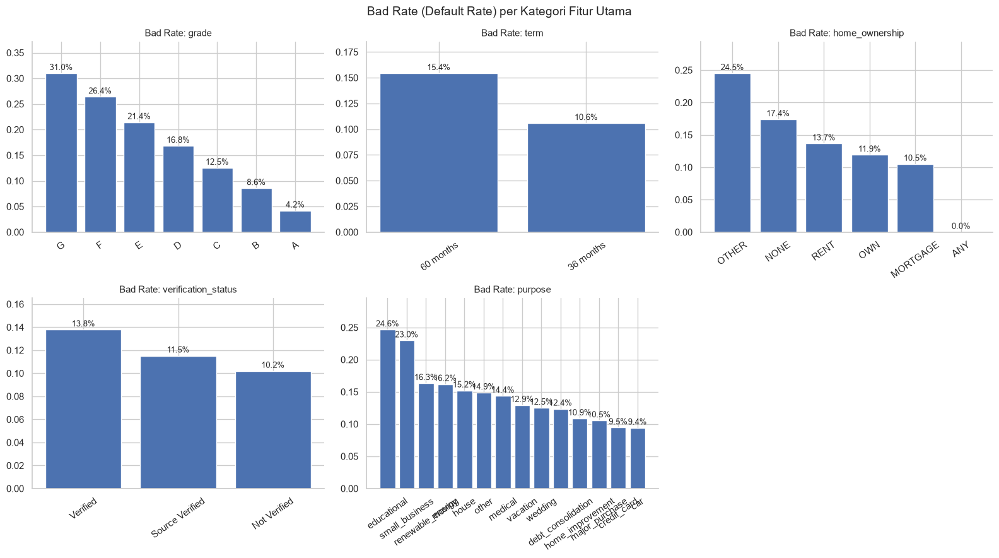
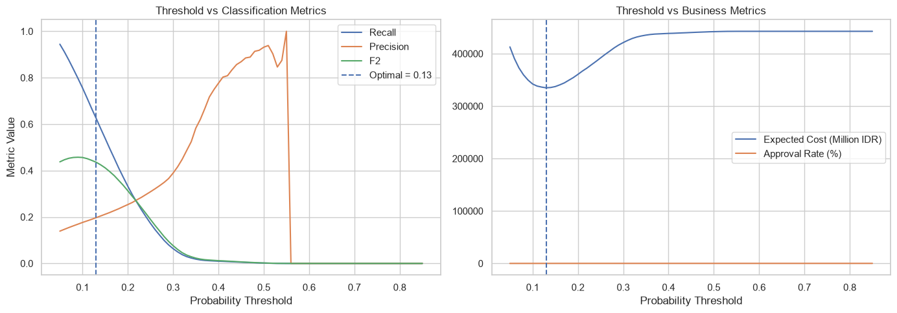
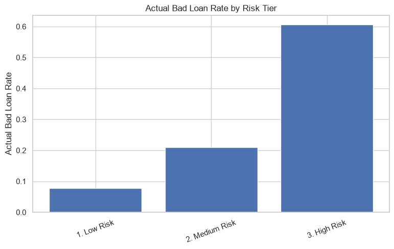
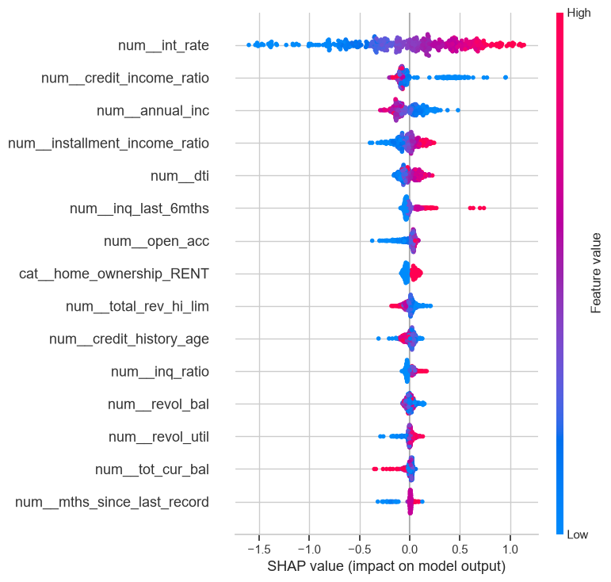

# Credit Risk Modeling

## Overview

Merupakan final project dari Virtual Internship Experience Data Scientist di IDX Partners yang diselenggarakan oleh Rakamin Academy. Proyek ini bertujuan membangun model Machine Learning untuk menghasilkan skor probabilitas gagal bayar (Probability of Default) serta mengidentifikasi fitur-fitur yang paling berpengaruh terhadap risiko kredit, sehingga dapat membantu stakeholder dalam mengambil keputusan kredit yang lebih tepat dan terukur.

---

## Problem

Terdapat dua jenis kesalahan yang perlu dipertimbangkan dalam pengambilan keputusan kredit:

1. Menyetujui peminjam yang gagal bayar, yang dapat menyebabkan kerugian finansial bagi lender.
2. Menolak peminjam yang sebenarnya mampu membayar, yang dapat menyebabkan hilangnya potensi pendapatan.

Target `loan_status` diubah menjadi label biner:
- `0 = Good Loan`
- `1 = Bad Loan`

---

### Target Distribution


**Insight:** Bad loan hanya sekitar 11–12% dari seluruh data, sehingga dataset termasuk dalam problem klasifikasi yang cukup imbalance. Model yang hanya dioptimalkan untuk accuracy dapat menghasilkan performa yang menyesatkan karena cenderung memprediksi mayoritas kelas sebagai Good Loan. Oleh karena itu, metrik seperti Recall, ROC-AUC, dan cost-based thresholding lebih relevan digunakan dibandingkan accuracy saja.

---

### Bad Rate by Category



**Insight:** Bad rate tidak flat di semua kategori. Polanya menunjukkan perbedaan risiko berdasarkan `grade`, `purpose`, `term`, `home_ownership`, dan `verification_status`. Grade yang lebih rendah dan term yang lebih panjang cenderung memiliki proporsi bad loan yang lebih tinggi. Hasil ini juga menjadi sanity check bahwa target telah didefinisikan secara masuk akal sebelum masuk ke tahap modeling.

---

## Data Preprocessing

- **Target Definition:** Status pinjaman dikelompokkan menjadi **Bad Loan (1)** dan **Good Loan (0)**. Status lainnya dihapus dari dataset.
- **Leakage Removal:** Menghapus fitur yang berpotensi menyebabkan data leakage, seperti informasi pasca-pencairan, identifier, dan kolom free-text.
- **Missing Values:** Fitur dengan missing value tinggi dievaluasi; fitur numerik diimputasi dengan **median** dan fitur kategorikal dengan **modus** melalui pipeline modeling.
- **Outlier Check:** Outlier pada fitur count seperti `delinq_2yrs`, `pub_rec`, dan `tot_coll_amt` dianalisis menggunakan IQR dan tidak di-clip secara agresif karena masih relevan secara bisnis.
- **Feature Engineering:** Menambahkan **7 fitur baru** terkait rasio pendapatan, kredit, riwayat kredit, dan delinquency. Statistik imputasi dan derivasi hanya dihitung dari **training set** untuk mencegah data leakage.
- **Final Features:** Menggunakan **44 fitur numerik** dan **5 fitur kategorikal** (`grade`, `term`, `home_ownership`, `verification_status`, `purpose`) dalam pipeline model.

---

## Modeling Approach

- **Data Split:** Dataset dibagi menjadi **80% training** dan **20% testing** dengan stratifikasi untuk menjaga proporsi bad rate (~11,9%) tetap konsisten.
- **Preprocessing Pipeline:** Fitur numerik diproses dengan **median imputation** dan **standard scaling**, sedangkan fitur kategorikal menggunakan **most-frequent imputation** dan **one-hot encoding** melalui `ColumnTransformer` dalam `sklearn Pipeline`.
- **Baseline Model:** Menggunakan **Logistic Regression** dengan `class_weight='balanced'`.
- **Model Comparison:** Logistic Regression, XGBoost, dan LightGBM dibandingkan menggunakan **5-fold Stratified Cross-Validation** berdasarkan metrik **Recall, Precision, F1-Score, dan ROC-AUC**.
- **Model Selection:** Dua model terbaik, yaitu **LightGBM** dan **XGBoost**, dituning menggunakan `RandomizedSearchCV`. LightGBM dipilih sebagai model final karena memberikan performa ROC-AUC terbaik setelah proses tuning.
- **Probability Calibration:** Model LightGBM yang telah dipilih kemudian dikalibrasi menggunakan `CalibratedClassifierCV` dengan metode **sigmoid** dan **5-fold cross-validation** agar probabilitas prediksi lebih sesuai dengan bad rate aktual.
- **Threshold Optimization:** Threshold klasifikasi dioptimalkan berdasarkan **expected business cost**, bukan menggunakan cutoff default 0,5.
- **Final Evaluation:** Model final dievaluasi pada **test set yang di-hold out** menggunakan threshold optimal untuk mengukur performa pada data yang belum pernah dilihat model.

---

### Model Comparison (5-fold CV)

| Model | Recall | Precision | F1 | ROC-AUC |
|---|---:|---:|---:|---:|
| LightGBM | 0.660 | 0.190 | 0.295 | 0.695 |
| XGBoost | 0.609 | 0.193 | 0.293 | 0.685 |
| Logistic Regression | 0.646 | 0.186 | 0.289 | 0.680 |

LightGBM memberikan performa CV ROC-AUC terbaik pada tahap perbandingan model awal dengan skor **0,695**. Setelah proses hyperparameter tuning, LightGBM tetap dipilih sebagai model final dengan ROC-AUC sebesar **0,696**, sedikit lebih tinggi dibandingkan XGBoost sebesar **0,695**.

---

## Model Evaluation

Metrik final pada test set (hold-out), menggunakan threshold hasil optimasi (**0,13**):

| Metric | Score |
|---|---:|
| Recall | 0.634 |
| Precision | 0.199 |
| F1-Score | 0.303 |
| ROC-AUC | 0.701 |
| PR-AUC | 0.249 |
| Brier Score | 0.099 |
| Approval Rate | 62.1% |

Confusion matrix pada threshold ini:

- **TN = 53.617**
- **FP = 28.177**
- **FN = 4.049**
- **TP = 7.017**

**Interpretation:** Pada threshold ini, model berhasil menangkap sekitar **63% bad loan** yang sebenarnya (Recall), dengan konsekuensi Precision yang relatif rendah (~20%). Artinya, sebagian besar applicant yang di-flag sebagai risiko tinggi sebenarnya merupakan Good Loan.

ROC-AUC sebesar **0,70** menunjukkan bahwa model mampu membedakan Good Loan dan Bad Loan dengan performa yang lebih baik dibandingkan tebakan acak. Namun, model belum sempurna dan masih menghasilkan jumlah false positive yang cukup tinggi dibandingkan false negative. Hal ini merupakan konsekuensi dari strategi threshold yang dirancang untuk memberikan penalti lebih besar terhadap kesalahan menyetujui peminjam yang berisiko gagal bayar.

---

## Threshold Optimization

Threshold default 0,5 tidak relevan untuk problem yang imbalance dan cost-sensitive karena false negative (menyetujui Bad Loan) dan false positive (menolak Good Loan) memiliki cost yang berbeda.

Notebook ini menggunakan estimasi cost sebesar:

- **Rp 10.000.000 per False Negative**
- **Rp 1.500.000 per False Positive**

Threshold diuji dari **0,05 hingga 0,85** untuk mencari nilai yang meminimalkan total expected cost. Pemilihan threshold dilakukan menggunakan **out-of-fold prediction** untuk mengurangi risiko overfitting terhadap data training.



**Insight:** Threshold optimal yang diperoleh adalah **0,13**, jauh lebih rendah dibandingkan threshold default 0,5, dengan out-of-fold recall sekitar **62,6%** dan approval rate sekitar **62,2%**.

Karena satu default yang terlewat memiliki cost yang jauh lebih besar dibandingkan satu Good Loan yang salah ditolak, strategi cost-sensitive mendorong model untuk lebih agresif dalam menandai applicant berisiko.

---

## Risk Segmentation

Predicted probability dari test set dikelompokkan menjadi tiga risk tier:

- **Low Risk:** PD < 0,15
- **Medium Risk:** 0,15 ≤ PD < 0,35
- **High Risk:** 0,35 ≤ PD < 0,60

Tujuannya adalah untuk melihat seberapa baik skor probabilitas model dalam membedakan tingkat risiko secara praktis.



**Insight:** Bad loan rate aktual meningkat cukup tajam antar tier:

- **Low Risk:** sekitar 7,7%
- **Medium Risk:** sekitar 21,0%
- **High Risk:** sekitar 60,6%

Average predicted probability cukup selaras dengan bad rate aktual pada dua tier pertama, meskipun sedikit understate pada tier High Risk. Pola ini menunjukkan bahwa skor probabilitas cukup berguna untuk **risk ranking**, prioritas review manual, atau verifikasi tambahan pada applicant berisiko tinggi.

Namun, model sebaiknya tidak digunakan sebagai satu-satunya dasar untuk keputusan approve/reject secara otomatis.

---

## Model Explainability

SHAP (`TreeExplainer`) digunakan pada sample sebanyak 500 baris dari test set untuk memahami fitur yang paling berpengaruh terhadap prediksi model.



**Insight:** `annual_inc`, `term`, `grade`, `loan_income_ratio`, `int_rate`, dan `dti` muncul sebagai fitur dengan pengaruh paling besar terhadap prediksi model.

Hasil ini sejalan dengan intuisi domain credit risk. Income dan fitur rasio berbasis income seperti loan-to-income dan installment-to-income memiliki pengaruh yang cukup besar, di samping variabel tradisional seperti grade dan interest rate.

Hal ini mendukung penggunaan fitur hasil feature engineering karena dapat memberikan informasi tambahan terkait kemampuan pembayaran applicant.

---

## Key Findings

- Dataset memiliki imbalance yang cukup signifikan (~7,4 Good Loan : 1 Bad Loan), sehingga diperlukan pendekatan khusus mulai dari `class_weight='balanced'` pada baseline hingga pemilihan threshold berbasis business cost.
- **LightGBM** memberikan performa terbaik dibandingkan XGBoost dan Logistic Regression berdasarkan hasil cross-validation dan hyperparameter tuning, dengan ROC-AUC sekitar **0,696**, sehingga dipilih sebagai model final.
- Model final kemudian dikalibrasi untuk menghasilkan probabilitas risiko yang lebih representatif terhadap bad rate aktual.
- Optimasi threshold berbasis expected business cost menurunkan cutoff menjadi **0,13**, sehingga model lebih fokus menangkap Bad Loan meskipun menghasilkan lebih banyak false positive.
- Pada test set, model menghasilkan **Recall 0,634**, **ROC-AUC 0,701**, dan **PR-AUC 0,249** pada threshold optimal.
- Risk tier menunjukkan peningkatan bad loan rate yang cukup jelas dan monoton (**7,7% → 21,0% → 60,6%**), sehingga probabilitas model cukup berguna untuk melakukan risk ranking.
- Analisis SHAP menunjukkan bahwa model terutama dipengaruhi oleh income, grade pinjaman, interest rate, term, dan fitur berbasis income, yang secara umum sesuai dengan intuisi domain credit risk.
- Secara keseluruhan, model lebih cocok digunakan sebagai **risk scoring dan risk ranking tool** untuk membantu pengambilan keputusan kredit, bukan sebagai satu-satunya dasar keputusan approve/reject otomatis.

---

## Tech Stack

- Python
- pandas
- numpy
- matplotlib
- seaborn
- scikit-learn (pipeline, preprocessing, model selection, calibration, metrics)
- XGBoost
- LightGBM
- SHAP

---

## How to Run

1. Install dependencies:

   ```bash
   pip install pandas numpy matplotlib seaborn scikit-learn xgboost lightgbm shap
## Project Structure

```
credit-risk-modeling/
├── README.md
├── main.ipynb
├── loan_data_2007_2014.csv
└── images/
    ├── target-distribution.png
    ├── bad-rate-by-category.png
    ├── threshold-optimization.png
    ├── risk-tier.png
    └── shap-summary.png
```

