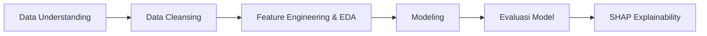
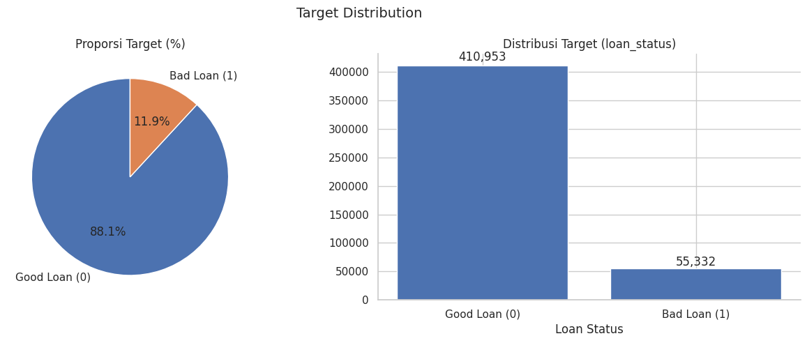
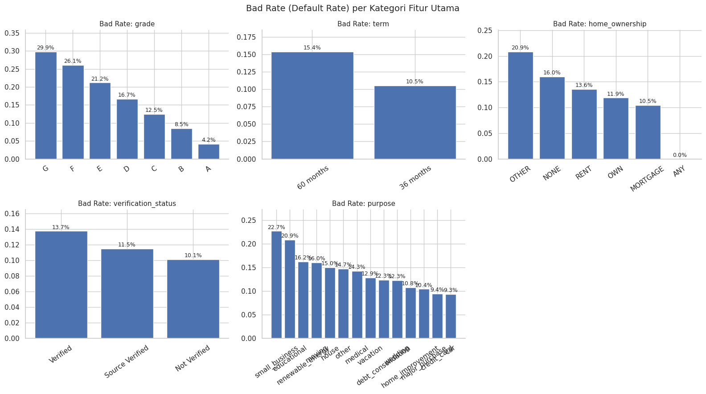
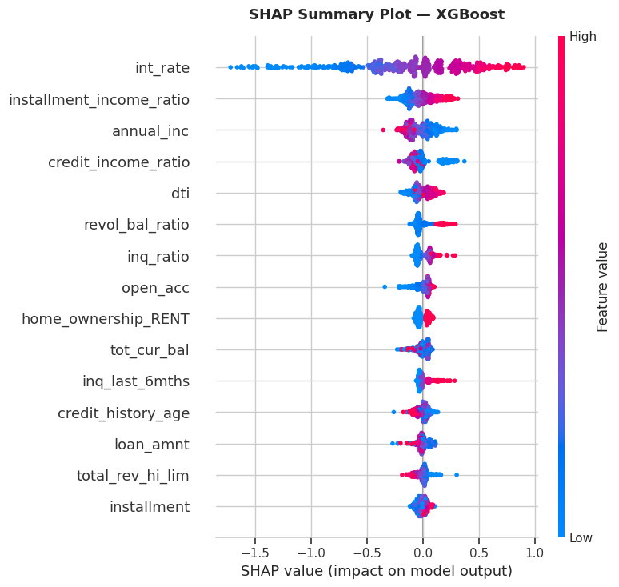
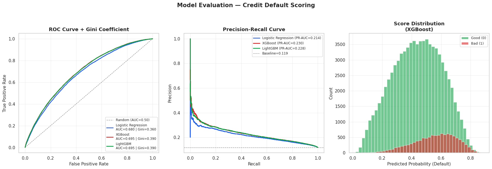

# Credit Risk Prediction - IDX Partners Data Science Project


---

## Overview

Merupakan final project dari Virtual Internship Experience Data Scientist di IDX Partners
yang diselenggarakan oleh Rakamin Academy. Perusahaan Fintech sering menghadapi risiko
gagal bayar karena tidak semua nasabah mampu melunasi pinjaman. Proyek ini bertujuan
membangun model Machine Learning yang menghasilkan skor probabilitas gagal bayar dan
mengidentifikasi fitur-fitur paling berpengaruh untuk pemahaman stakeholder.

---

## Business Understanding
* **Problem Statement:** Ada dua jenis kesalahan yang perlu diminimalkan oleh perusahaan:
    1. Menyetujui nasabah yang gagal bayar (menyebabkan kerugian finansial langsung).
    2. Menolak nasabah yang mampu bayar (menyebabkan hilangnya potensi pendapatan).
* **Business Objective:** Mengembangkan model prediktif untuk mengklasifikasikan nasabah menjadi kelas `0` (Good Loan / Low Risk) dan kelas `1` (Bad Loan / High Risk).
* **Business Metric:** Mengoptimalkan metrik **Recall** dan **ROC-AUC** untuk meminimalkan *False Negatives* (nasabah gagal bayar yang lolos persetujuan) tanpa mengorbankan terlalu banyak *False Positives*.

---

## Workflow



---

## Hasil & Insight

### 1. Target Distribution



> **Insight:** Dataset mengalami **class imbalance signifikan**
> (88.1% Good Loan vs 11.9% Bad Loan, dari total 466.285 data).
> Tanpa penanganan, model akan bias memprediksi hampir semua nasabah sebagai
> "good". Solusi yang diterapkan: `scale_pos_weight` pada XGBoost/LightGBM
> untuk memastikan loss function tetap memperhatikan kelas minoritas.

---

### 2. Bad Rate per Kategori Fitur Utama



> **Insight:** Bad rate naik konsisten dari Grade A (4.2%) hingga Grade G (29.9%) —
> perbedaan **7× lipat**, menjadikan `grade` sebagai fitur kategoris paling
> prediktif. Temuan menarik: nasabah dengan status "Verified" justru memiliki
> bad rate lebih tinggi (13.7%) dibanding "Not Verified" (10.1%), mengindikasikan
> **adverse selection** — peminjam berisiko tinggi lebih sering diminta verifikasi
> oleh platform. Pinjaman tujuan `small_business` dan `educational` mencatat bad
> rate tertinggi (22.7% dan 20.9%).

---

### 3. SHAP Feature Importance



> **Insight:** `int_rate` adalah driver prediksi terkuat — nilai tinggi secara
> konsisten mendorong probabilitas default ke atas. **Mayoritas fitur top-15
> merupakan hasil feature engineering** (`installment_income_ratio`,
> `credit_income_ratio`, `revol_bal_ratio`, `inq_ratio`) yang dibangun dari
> domain knowledge, bukan fitur mentah. Ini membuktikan bahwa rekayasa fitur
> berbasis pemahaman bisnis menghasilkan sinyal lebih kuat dibanding volume
> fitur raw.

---

### 4. Model Evaluation



> **Insight:** LightGBM dan XGBoost mencapai performa identik di ROC-AUC (0.695)
> dengan Gini 0.390. LightGBM dipilih sebagai model final karena efisiensi
> komputasi dan memori yang lebih baik — relevan untuk production deployment.
> Score distribution menunjukkan separasi yang baik antara Good dan Bad Loan,
> mengonfirmasi model memiliki kemampuan diskriminasi yang layak secara
> operasional. Logistic Regression sebagai baseline sudah mencapai AUC 0.680 —
> membuktikan fitur-fitur yang direkayasa informatif bahkan untuk model linear.

---

## Business Impact

Model ini dirancang untuk mendukung keputusan kredit yang lebih akurat dan
efisien. Berikut implikasi bisnis konkret yang dapat diperoleh:

**Pengurangan Credit Loss**
Dengan Gini 0.390, model mampu meranking nasabah berdasarkan risiko secara
signifikan lebih baik dari random. Pada praktiknya, menolak 20% peminjam
dengan skor risiko tertinggi berpotensi mengeliminasi porsi besar dari total
default tanpa mengorbankan approval rate secara keseluruhan.

**Efisiensi Proses Kredit**
Nasabah Grade F–G (bad rate 21–30%) dapat langsung masuk tier *review manual*
sebelum scoring model dijalankan, menghemat waktu proses untuk mayoritas
pengajuan yang profilnya jelas.

**Keputusan yang Dapat Dijelaskan**
SHAP memungkinkan model dikomunikasikan ke tim bisnis dan regulator: setiap
keputusan penolakan dapat disertai alasan konkret — misalnya "suku bunga
tinggi dikombinasikan dengan rasio cicilan yang besar relatif terhadap
pendapatan". Ini penting untuk kepatuhan regulasi dan kepercayaan nasabah.

**Deteksi Adverse Selection**
Temuan bahwa nasabah "Verified" memiliki bad rate lebih tinggi membuka peluang
untuk mereview ulang proses verifikasi — apakah threshold verifikasi sudah
tepat menyasar profil risiko yang seharusnya.

---

## Cara Menjalankan

```bash
# Clone repository
git clone https://github.com/username/credit-risk-prediction.git
cd credit-risk-prediction

```

## Tech Stack

| Library | Fungsi |
|---|---|
| `pandas` · `numpy` | Data wrangling & manipulasi |
| `scikit-learn` | Pipeline, preprocessing, evaluasi |
| `imbalanced-learn` | SMOTE oversampling untuk class imbalance |
| `XGBoost` · `LightGBM` | Gradient boosting classifier |
| `SHAP` | Explainability — global & per-nasabah |
| `matplotlib` · `seaborn` | Visualisasi EDA & evaluasi |
